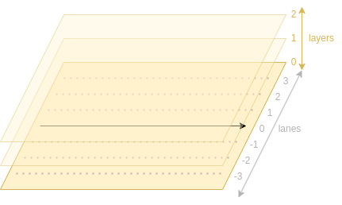

# Timeline Layer and Lanes Model
ADR state: `valid`

## Description
This project represents a timeline plot using the following layer and lanes model:

1. A timeline arrow is placed inside the canvas, 
   allowing the placement of plot elements within a time dimension
2. **Lanes** define regular distances from the timeline,
   allowing the placement of plot elements perpendicular to the time dimension
3. **Layer** are plotted on top of each other,
   allowing to control which plot elements are shown in case of overlaps

## Justification
The central element of a timeline plot is the arrow;
other elements need to be positioned relative to it.
The horizontal positioning is naturally given via the time dimension.

Lanes provide a simple solution for the vertical positioning,
since the user can be provided with reasonable defaults (integer values),
but can still utilize the full canvas by specifying float values instead.

Layers are needed to allow the drawing of certain elements in front of each other.
For example, text might be unreadable if drawn behind other timeline elements.
